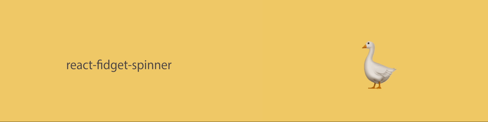

# React Fidget Spinner

[](https://github.com/morewings/react-library-template/actions/workflows/merge-jobs.yml)
[](https://github.com/whatsrupp/react-fidget-spinner/actions/workflows/pages.yml)

Turn any react component into a clickable fidget spinner.

[](#)
*not just this goose* 🪿

## Quickstart

1. Install

```sh
npm i react-fidget-spinner
```

See interactive examples on [Storybook](https://whatsrupp.github.io/react-fidget-spinner).

## Key Concepts

- Sparks
- Bubbles
- Flames
- Spinner
- Flywheel
- Energy
- Restting
- Velocity Breakpoints

## Motivations and Context

I've wanted to publish an npm package for a while now but never had a good reason to. I don't think this is a _particularly_ good reason but it is quick and fun.

I wanted to make the animations and experience heavily customisable so that people would be equipped to make the spinners as stupid as they want.

I also wanted to model the fidget spinner in a way that was _somewhat_ realistic, I used concepts related to mechanical flywheels that I learnt about a while ago at uni.

Each click on the spinner injects a burst of energy into the rotating flywheel. (sort of like flicking an actual fidget spinner)
The spinner will then slow down based on various properties like inertia and friction.


